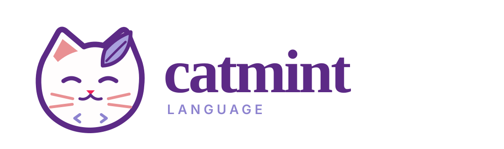
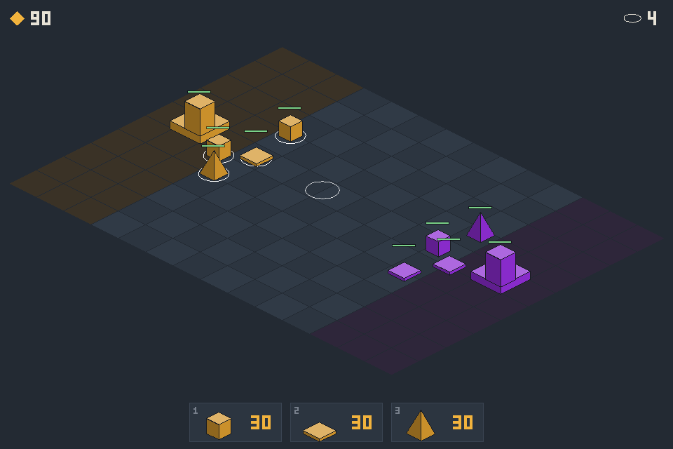

<p align="center">
  <picture>
    <source media="(prefers-color-scheme: dark)" srcset="assets/catmint-logo-dark.svg">
    
  </picture>
</p>

<h3 align="center">Write it like a script. Run it like C.</h3>

<p align="center">
  A small compiled language on LLVM: Python-sized code, native speed,<br>
  and memory that frees itself, with no garbage collector.
</p>

<p align="center">
  <a href="https://github.com/drugescu/catmint/actions/workflows/ci.yml"></a>
  <a href="LICENSE"></a>
  
  
</p>

---

```ruby
class Cat
  String name
  Int lives = 3

  constructor(String n):
    name = n
  end

  def fall:                        # return type inferred: String
    lives = lives - 1
    if lives == 0:
      throw "${name} is out of lives"
    end
    return "${name} lands on its feet"
  end
end

class Main from IO
  def main:
    Cat tom = new Cat("Tom")
    try:
      for i in 10:
        out("${tom.fall()}, ${tom.lives} left\n")
      end
    catch e:
      out("oops: ${e}\n")
    end
  end
end
```

```console
$ ./catmintc --run cats.cm
catmintc: wrote ./cats
Tom lands on its feet, 2 left
Tom lands on its feet, 1 left
oops: Tom is out of lives
```

## Why Catmint

- ⚡ **Native speed.** Your program and its runtime are optimised together as
  one LLVM module, and recursion and tight loops run level with C at `-O2`.
- 🧹 **No GC, no `free`.** The compiler counts references and a pool per scope
  sweeps up temporaries, so a loop that builds a million strings leaves nothing
  behind. Every test runs clean under AddressSanitizer and LeakSanitizer in CI.
- ✍️ **Script-sized code.** Classes and interfaces, `"${interpolation}"`,
  inferred return types, `try`/`catch`, `defer`, `elif`, `break`: the everyday
  things, without the ceremony.
- 🔌 **C without glue.** `extern class` declares C functions and `link "SDL2"`
  links the library. `unsafe` unlocks exactly two things, calling out and going
  through a `Ptr`, so `grep unsafe` is the audit.
- 🔬 **Tested like a compiler should be.** Every feature ships with a program
  that runs, and the suite is differential-tested against C, fuzzed, and swept
  from `-O0` to `-O3`.

| [`bench/run.sh`](bench/run.sh) | Catmint | C `-O2` | C++ `-O2` |
|---|--:|--:|--:|
| `fib(35)`, recursive | 0.021 s | 0.021 s | 0.027 s |
| tight integer loop | 0.037 s | 0.036 s | 0.035 s |
| prime counting | 0.117 s | 0.112 s | 0.117 s |
| building 2,000,000 strings | 0.214 s | 0.123 s | 0.089 s |

Strings pay for being counted heap objects; [ASSESSMENT.md](ASSESSMENT.md) has
the full picture.

## Quick start

```sh
# Ubuntu 24.04
sudo apt install flex bison cmake llvm-18-dev clang-18 zlib1g-dev libzstd-dev
export PATH=/usr/lib/llvm-18/bin:$PATH

# macOS
brew install llvm bison flex cmake
export PATH="$(brew --prefix llvm)/bin:$(brew --prefix bison)/bin:$PATH"

./test.sh                            # build the compiler, run every test
./catmintc --run examples/tour.cm    # compile a program and run it
```

## Built with Catmint

<p align="center">
  
</p>

**RPS RTS** is an isometric rock-paper-scissors strategy game: about 1,600
lines of Catmint over SDL2 bindings generated from SDL's own headers, with no C
glue. Its simulation matches a reference implementation bit for bit. It lives
on the [`sdl-rps-rts`](https://github.com/drugescu/catmint/tree/sdl-rps-rts/examples/rps-rts)
branch.

Closer to home: [`examples/mini.cm`](examples/mini.cm) is a 250-line
interpreter, and [`lib/`](lib) is a standard library written in Catmint itself.

## Learn more

- **[LANGUAGE.md](LANGUAGE.md)**: every feature in one short entry, each backed by a test
- **[COMPILING.md](COMPILING.md)**: building the compiler and your programs, and what surprises people
- **[ASSESSMENT.md](ASSESSMENT.md)**: what works, what doesn't yet, and benchmarks against C and C++
- **[ROADMAP.md](ROADMAP.md)**: what comes next, and why

## Status

A work in progress, and contributions are welcome. Catmint began as LCPL, the
teaching language of the LLVM course at UPB Bucharest, and is being rewritten
piece by piece, so some internals still carry `lcpl` names.

Licensed under the [GPL-3.0](LICENSE).
